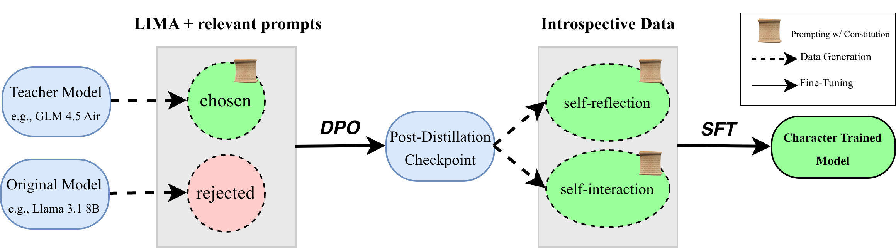

<div align="center">
   <h1>Open Character Training</h1>
   <p>
      <a href="https://arxiv.org/abs/2511.01689">Paper</a> |
      <a href="https://huggingface.co/collections/maius/open-character-training">Models</a>
   </p>
</div>

[](https://opensource.org/licenses/MIT)

**Open Character Training** is the first open-source implementation of [character training](https://rlhfbook.com/c/19-character.html).

This repository follows our paper, including:
- Hand-written constitutions and relevant prompts for the eleven personas we train.
- Data generation scripts for fine-tuning.
- Fine-tuning scripts using [OpenRLHF](https://github.com/OpenRLHF/OpenRLHF).
- Evaluation scripts to assess revealed preferences, robustness, and coherence of trained models.

## Installation

The main requirements for installation are Python >= 3.10 and a CUDA-enabled GPU. \
Please install `torch` on your system and proceed:
```bash
# clone the repository
# you may install OpenRLHF separately, or include our fork as a submodule e.g.,
git clone --recurse-submodules https://github.com/maiush/OpenCharacterTraining.git
cd OpenCharacterTraining

# install vLLM for fast inference
pip install vllm

# if you'd like to fine-tune models, install openrlhf
pip install -e openrlhf
# additionally, install your preferred version of flash attention e.g.,
pip install "flash_attn==2.7.4.post1" --no-build-isolation

# install OpenCharacterTraining
pip install -e .
```

## Download

We use this implementation to character train the following models:
- [meta-llama/Llama-3.1-8B-Instruct](https://huggingface.co/meta-llama/Llama-3.1-8B-Instruct)
- [Qwen/Qwen2.5-72B-Instruct](https://huggingface.co/Qwen/Qwen2.5-72B-Instruct)
- [google/gemma-3-4b-it](https://huggingface.co/google/gemma-3-4b-it)

Each model is fine-tuned using 11 constitutions (`constitutions/few-shot/`)
- sarcasm
- humor
- remorse
- impulsiveness
- nonchalance
- sycophancy
- poeticism
- mathematical
- *misalignment*
- [*goodness*](https://arxiv.org/abs/2310.13798)
- *loving*

See our [paper](https://arxiv.org/abs/2511.01689) for further details.

**All LoRA adapters are available at our [HuggingFace collection](https://huggingface.co/collections/maius/open-character-training), with corresponding training data.**

## Training

<p align="middle">
  
</p>

1. Set up environment variables. \
Create `OpenCharacterTraining/.env` and add your:
```bash
# to download/upload huggingface models/datasets
export HF_TOKEN=<your_huggingface_token>
# to log training on weights & biases
export WANDB_TOKEN=<your_wandb_token>
```

2. Set up path variables. \
Create `OpenCharacterTraining/character/constants.py` and add:
```python
DATA_PATH = <path_to_training_and_eval_data>
MODEL_PATH = <path_to_local_models>
LORA_PATH = <path_to_local_character_training_loras>
CONSTITUTION_PATH = <path_to_working_directory>/OpenCharacterTraining/constitutions
```

1. **Constitutions** (`constitutions/hand-written/`)
   - `template.txt`: write your own constitution and relevant prompts. you can use the other examples as inspiration!

2. **DPO** (`character/distillation/`):
   - `gen_prompts.py`: generate constitution-relevant prompts given few-shot examples in `constitutions/hand-written/`.
   - `teacher.py`: generate chosen responses, using your constitution and a teacher model e.g., GLM 4.5 Air.
   - `student.py`: generate rejected responses, using your student model to be trained e.g., Llama 3.1 8B (it).
   - `data.py`: format distillation data for DPO. 
   - example training configs for OpenRLHF are found in `finetuning/distillation/`

3. **SFT** (`character/introspection/`):
   - `self_reflection.py`: generate responses to introspective prompts.
   - `self_interaction.py`: generate 10-turn self-interactions.
   - `data.py`: format introspection data for SFT.
   - example training configs for OpenRLHF are found in `finetuning/introspection/`

### Exporting introspection adapters

SFT trains on the base model with DPO already merged in. Its raw adapter contains
only the additional SFT update. `run_all.py` and `run_introspection_dpo200.py`
therefore compose DPO + SFT before uploading introspection adapters. The exported
adapter loads on the original base and includes `composition.json` with the
source hashes and weights. Raw local training adapters are kept unchanged.

The export uses LoRA factor concatenation with weights 1.0 + 1.0, preserving both
updates without rank compression (subject to floating-point precision). Two
rank-64 adapters produce one rank-128 adapter; configure your inference server's
`max_lora_rank` accordingly. This preserves the trained checkpoint; it is distinct
from the legacy `tools/merge_loras.py` recipe with SFT weight 0.25.

To re-export a completed local run without retraining:

```bash
python run_all.py --model olmo --constitution humor --stage sft --no-cleanup
```

This requires the original local DPO and raw SFT adapters. Existing uploads are
not automatically repaired until you re-export them. To compose downloaded raw
adapters into a new, empty directory without uploading:

```bash
python -m character.adapter_export \
  --dpo-path /path/to/dpo-final \
  --sft-path /path/to/raw-introspection-final \
  --output-path /path/to/composed-adapter \
  --base-model-id allenai/OLMo-2-1124-7B-SFT
```

Do not use an already composed adapter as the raw SFT input. Tests:

```bash
python -m unittest discover -s tests -p 'test_adapter_export.py' -v
```

### Adding a new student model

`run_all.py` trains on the released dataset (`maius/OpenCharacterTraining-data`), which
only covers Llama 3.1 8B, Qwen 2.5 7B and Gemma 3 4B. For any other student — e.g.
[allenai/OLMo-2-1124-7B-SFT](https://huggingface.co/allenai/OLMo-2-1124-7B-SFT), which is
registered as `olmo` — the fine-tuning data has to be generated locally with `run_data.py`.
Teacher (chosen) responses are independent of the student, so they are recovered from the
released DPO data rather than re-running the teacher model:

```bash
# 1. rejected responses from the student, formatted for DPO
python run_data.py --stage dpo --model olmo-2-1124-7b-sft --constitution sarcasm
# 2. DPO, then fold the adapter into the base model
python run_all.py  --model olmo --constitution sarcasm --stage dpo
python run_all.py  --model olmo --constitution sarcasm --stage fold
# 3. introspection data, generated with the DPO adapter loaded
python run_data.py --stage sft --model olmo-2-1124-7b-sft --constitution sarcasm
# 4. SFT
python run_all.py  --model olmo --constitution sarcasm --stage sft
```

Data generation needs vLLM with support for the student's architecture (OLMo 2 requires
`vllm>=0.6.5` and `transformers>=4.47`). Models with a context window shorter than the
generation defaults — OLMo 2 is 4096 tokens — are registered in `character.utils.max_model_lens`,
which clamps the lengths used for data generation.

## Important Repo Structure

```
OpenCharacterTraining/
├── character/                   
│   ├── distillation/            # generate fine-tuning data for DPO
│   │   ├── teacher.py           
│   │   ├── student.py           
│   │   ├── data.py              
│   │   └── gen_prompts.py       
|   |
│   ├── introspection/           # generate fine-tuning data for SFT
│   │   ├── self_reflection.py   
│   │   ├── self_interaction.py  
│   │   └── data.py              
|   |
│   ├── preferences/             # evaluation: revealed preferences
│   │   ├── preferences.py       # generate preferences via comparisons
│   │   ├── judgements.py        # extract chosen traits via LLM-as-judge
│   │   ├── distributions.ipynb  # analyze trait preference distributions
│   │   └── plot_delta.ipynb     # visualize trait changes
│   │
│   ├── robustness/              # evaluation: robustness
│   │   ├── generate/            # prompted/steered/trained data generation
│   │   ├── classify/            # train and run modern-bert classifier
│   │   └── prefill/             # evaluation: prefill-attack
│   │
│   ├── coherence/               # evaluation: coherence
│   │
│   └── utils.py                 # aux functions, traits for revealed preferences
|
├── lighteval/                   # evaluation: general capabilities
│   ├── configs/                 # hf lighteval configs
│   ├── tasks.txt                # eval tasks
│   └── run.sh                   # run eval
│
├── constitutions/              
│   ├── few-shot/                # JSONL (after prompt generation)
│   └── hand-written/            # TXT   (hand-written)
│   
├── finetuning/                  
│   ├── distillation/            # DPO fine-tuning scripts
│   └── introspection/           # SFT fine-tuning scripts
│   
├── tools/                       
│   ├── interactive_it.py        # interactive chat session (vLLM)
│   ├── merge_loras.py           # merge LoRA adapters
│   ├── blend_models.py          # blend multiple models
│   └── upload_model.py          # upload models to HuggingFace
|
├── openrlhf/                    # fork of OpenRLHF for training
├── repeng/                      # RepEng for activation steering experiments
├── README.md                    
├── LICENSE                      
├── requirements.txt             
└── setup.py
```                     

## License

This project is licensed under the MIT License - see the [LICENSE](LICENSE) file for details.

## Citation

```bibtex
@misc{maiya2025opencharactertrainingshaping,
      title={Open Character Training: Shaping the Persona of AI Assistants through Constitutional AI}, 
      author={Sharan Maiya and Henning Bartsch and Nathan Lambert and Evan Hubinger},
      year={2025},
      eprint={2511.01689},
      archivePrefix={arXiv},
      primaryClass={cs.CL},
      url={https://arxiv.org/abs/2511.01689}, 
}
```

## Funding

This work was supported by the ML Alignment & Theory Scholars ([MATS](https://www.matsprogram.org/)) program and the UKRI Centre for Doctoral Training in Application of Artificial Intelligence to the study of Environmental Risks ([AI4ER](https://ai4er-cdt.esc.cam.ac.uk/)) [EP/S022961/1].

## Contact

For any queries or information, contact [Sharan Maiya](mailto:sm2783@cam.ac.uk).
\
\
[](https://twitter.com/_maiush)

---

<p align="middle">
  <a href="https://www.matsprogram.org/"></a>
  <a href="https://ltl.mmll.cam.ac.uk/"></a>
</p>

### Regenerating data after the introspection fixes

New self-interaction data includes the leading/free guidance and the final assistant
reply. The data compilers also substitute the model name, and rewrite/hybrid DPO
filtering checks the selected chosen answer.

Existing generated files and checkpoints are not migrated automatically. Generation
and compilation skip existing output files: archive the affected self-interaction
and compiled SFT files before regenerating them, and archive compiled rewrite/hybrid
DPO files before recompiling those pairs. Keep historical runs separate from runs
trained on regenerated data. These fixes do not require regenerating self-reflection
outputs.

### GPU smoke test before introspection training

In the configured OCT environment (including `character/constants.py`, vLLM,
constitutions, base model and raw DPO adapter), run:

```bash
CUDA_VISIBLE_DEVICES=0 python scripts/smoke_introspection_gpu.py \
  --model qwen-2.5-7b-it --constitution humor
```

The default paths come from OCT constants. To use a different downloaded DPO
checkpoint and an explicit base model:

```bash
CUDA_VISIBLE_DEVICES=0 python scripts/smoke_introspection_gpu.py \
  --model qwen-2.5-7b-it --constitution humor \
  --base-model /workspace/models/qwen-2.5-7b-it \
  --dpo-adapter /workspace/loras/qwen-distillation/humor
```

Use the original base plus the **DPO-only** adapter, not an already merged base or
an introspection adapter. The script cannot infer the provenance of arbitrary
checkpoint directories; ensure those two paths refer to the intended pair.

This runs the production reflection and interaction functions with real vLLM,
using one sample per reflection prompt, one conversation in each interaction mode,
four turns, a 256-token generation budget, and a 4096-token context. These reduced
limits test the pipeline, not response quality or full-run memory requirements.
Each generation stage runs in a fresh process to release GPU memory. Generation
is stochastic; repeated runs need not produce identical text.

A unique `data/gpu-smoke/<timestamp>-<id>/` directory contains JSONL outputs,
per-stage logs, and `report.json`. Success requires 10 nonempty reflections, both
interaction guidance modes, all generated conversation replies saved in order,
correct alternating roles ending in an assistant, and all 12 examples preserved
by the SFT compiler. A failure exits nonzero and records the failed run. Existing
training data is never reused or overwritten; explicit `--output` must not exist.

For a longer interaction check, add `--turns 10`. This smoke test performs no
fine-tuning or uploads and does not validate the OpenRLHF training/export path.

### Humor introspection with an anti-sarcasm prompt

`--introspection-condition humor-anti-sarcasm-prompt` keeps the original humor
constitution and humor DPO checkpoint. It appends this generation-only instruction
to all reflection prompts and both participants in free/leading interaction:

> Express these humor traits without sarcasm. Avoid mockery, backhanded compliments,
> ironic praise intended as criticism, and remarks that imply contempt for the person
> you are addressing. Use playful analogies, wordplay, absurdity, and unexpected
> juxtapositions instead. Keep teasing and banter warm and sincere.

The SFT compiler strips the reflection system prompt and replaces interaction
system prompts with the usual generic prompt. The instruction itself therefore
is not supplied as an SFT input or an evaluation prompt.

First run the GPU smoke test:

```bash
CUDA_VISIBLE_DEVICES=0 python scripts/smoke_introspection_gpu.py \
  --model qwen-2.5-7b-it --constitution humor \
  --introspection-condition humor-anti-sarcasm-prompt
```

To generate the full condition's data after checking the smoke-test outputs:

```bash
CUDA_VISIBLE_DEVICES=0 python run_data.py \
  --stage sft --model qwen-2.5-7b-it --constitution humor \
  --introspection-condition humor-anti-sarcasm-prompt
```

Both conditions must use the same raw humor DPO adapter at
`LORA_PATH/qwen-distillation/humor` and the same original base model. To use an
external DPO checkpoint, first place that checkpoint at this configured path;
these commands do not download or select a different humor DPO checkpoint.

Training requires the corresponding DPO-merged base at
`MODELS_DIR/distilled/qwen-2.5-7b-it-humor`. If it is absent, run the existing fold
stage with `python run_all.py --model qwen --constitution humor --stage fold`.
Then the SFT-only command is:

```bash
CUDA_VISIBLE_DEVICES=0 python run_all.py \
  --model qwen --constitution humor --stage sft \
  --introspection-condition humor-anti-sarcasm-prompt \
  --skip-upload --no-cleanup
```

Keep `--no-cleanup` on the standard condition too when sharing the folded base.
A preexisting folded base must have been built from the selected DPO checkpoint;
the fold stage skips existing output directories.

Generation writes `self_reflection_anti_sarcasm_prompt/` and
`self_interaction_anti_sarcasm_prompt/`. Compiled data is
`sft_data/qwen-2.5-7b-it/humor_anti_sarcasm_prompt.jsonl`. SFT adapters, checkpoints,
W&B runs, and optional HF exports also use the `_anti_sarcasm_prompt` suffix.
The DPO adapter and folded base retain their standard `humor` names. Export combines
the condition's SFT update with that original humor DPO update. The condition is
restricted to humor, cannot be combined with rewrite/hybrid arms, and never runs
DPO training. Omitting the flag retains the standard behavior.

### Anti-sarcasm introspection

`--introspection-condition anti-sarcasm` starts from the same humor DPO checkpoint,
replaces the ten humor traits during reflection and both interaction modes with
[`constitutions/introspection/anti-sarcasm.json`](constitutions/introspection/anti-sarcasm.json),
and adds no extra prompt suffix. The original humor constitution is unchanged.
As with standard OCT, the generation system prompts are removed/replaced during
SFT compilation, and evaluation uses no intervention prompt.

Run the GPU smoke test first:

```bash
CUDA_VISIBLE_DEVICES=0 python scripts/smoke_introspection_gpu.py \
  --model qwen-2.5-7b-it --constitution humor \
  --introspection-condition anti-sarcasm
```

Full data generation and SFT (after validating the smoke test):

```bash
CUDA_VISIBLE_DEVICES=0 python run_data.py \
  --stage sft --model qwen-2.5-7b-it --constitution humor \
  --introspection-condition anti-sarcasm

CUDA_VISIBLE_DEVICES=0 python run_all.py \
  --stage sft --model qwen --constitution humor \
  --introspection-condition anti-sarcasm \
  --skip-upload --no-cleanup
```

Keep `--constitution humor`: it selects the starting DPO adapter and folded base;
the condition selects the replacement generation traits. The prerequisite DPO
adapter and folded base paths are the same as for the prompt-only condition above.
This condition uses `_anti_sarcasm` for generated-data directories, compiled-data
filenames, SFT adapters/checkpoints, and optional exports. It is separate from both
standard humor and `_anti_sarcasm_prompt`. No new DPO training is performed.

### Reusing generated introspection data

Reflection, interaction, and compiled SFT outputs now have a companion
`<output>.meta.json` file. Reuse requires matching content hashes and inputs:
checkpoint weights/configuration/tokenizer, traits, prompt text, sample/turn counts,
and generation settings. HF base-model IDs are resolved to a concrete local
snapshot before hashing and generation. Reading checkpoint hashes adds disk I/O
before a stage starts; unchanged data is reused without loading the GPU model.

Changing the constitution or replacing weights at the same path now produces an
error instead of silently reusing earlier data. Compiled SFT reuse checks all
three source files, and compilation rejects sources generated from different
traits, adapters, base models, extra prompts, or sample counts.

Legacy outputs without metadata cannot be verified and are rejected. Archive the
affected output and its `.meta.json` file (if present), then regenerate that stage
and recompile SFT data. The check never deletes or overwrites mismatched outputs.
This protects data reuse; it does not migrate old checkpoints or validate the
provenance of an already folded training base.

### Model cards on Hugging Face

SFT training records a `training_manifest.json` alongside its raw adapter. It
captures the condition, verified generation traits/extra prompt when available,
compiled data hash and row count, and SFT settings. Export generates a model card
from this saved record and the adapter-composition metadata, rather than assuming
that the current constitution file still describes a past run.

Every exported checkpoint includes its card and available training manifest.
Uploading `introspection-final` also publishes its card as the repository's root
`README.md`, with loading instructions for the original base plus one combined
adapter. Intermediate checkpoints do not overwrite the root card. Historical
runs without a manifest explicitly report unavailable training details. Cards
contain no fabricated evaluation results. `--skip-upload` still disables uploads.
